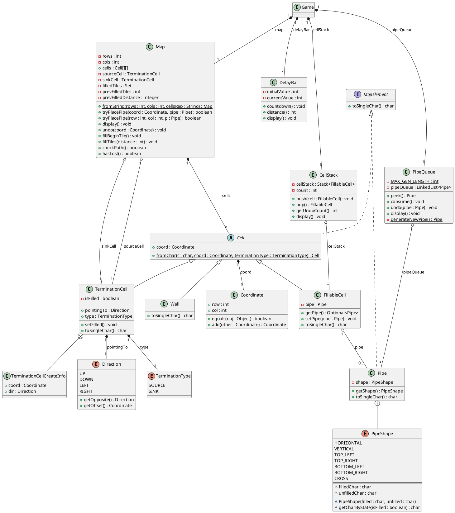

You are a senior Java software engineer.

Based on the requirement, class diagram, and already implemented classes, generate the complete Java project code.

## Goal
Create the missing Java classes and complete the project implementation.

## Inputs
### Input 1: Requirements
```text
1.Overall/Domain
  Console pipe-connection game: grid with outer walls, one source inside pointing inward, one sink on the border
  pointing outward. Player places pipes from a queue; after a delay, water flows along placed pipes.
  Coordinates are 1-based. Direction provides four directions plus opposite/offset; PipeShape defines connection
  directions; TerminationType distinguishes SOURCE vs SINK.
2.Functional Requirements
  Coordinate and Direction: The system manages 2D grid coordinates through the Coordinate class with 1-based indexing.
  Direction enum provides four directions (UP, DOWN, LEFT, RIGHT) with getOpposite() returning the opposite direction
  and getOffset() returning the unit coordinate offset for movement calculations.

  Game: Operations to place a pipe, skip, undo, advance water flow, check win, check loss; convenience fromString
  constructor; maintain step count. Operation placePipe: This method should convert the row and column into Coordinate
  and try to place the pipe on the map. If this succeeds, also update the pipe queue, delay bar, cell stack, and the
  number of steps. Operation skipPipe: Consumes the current pipe from the queue and increments the step count. Operation
   undoStep: Pops the last placed cell from CellStack, restores the pipe to the queue head, clears the cell on the map,
  and increments the step count. Returns false if there are no steps to undo.

  Map: Operations to place pipe (by coord or row/col), undo a cell, start filling from source, expand filling by
  distance, check path existence, check loss state. Cells are stored as a 2D array Cell[][]; provide helpers
  getCell(row,col) and setCell(row,col,cell) with bounds checks. tryPlacePipe: Returns false if coordinates are out of
  bounds, the target cell is not a FillableCell, or the cell already contains a pipe. Map construction constraints: must
   contain exactly one SOURCE in a non-edge cell, exactly one SINK in an edge cell, SOURCE must not point into a wall,
  SINK must point outside the map.

  Cell family: Cell.fromChar parses map chars to concrete cells; FillableCell holds an optional pipe and renders pipe or
   '.'; TerminationCell holds pointingTo direction and Type (SOURCE/SINK), with filled state for rendering; Wall renders
   wall char.

  TerminationCell.toSingleChar: Returns the corresponding arrow character based on the current termination cell's
  filling state and pointingTo direction: when filled, returns the arrow from PipePatterns.Filled; when unfilled,
  returns the arrow from PipePatterns.Unfilled. Both SOURCE and SINK use pointingTo directly without direction reversal.
 

  Pipe: Expose connection directions via getConnections() returning Direction[] based on Shape; char rendering by
  filled/unfilled state; construct from short string code (HZ, VT, TL, TR, BL, BR, CR). getConnections(): Returns the
  list of connection directions based on the current pipe shape;  toSingleChar(): Returns the character representation of this pipe, different for filled and
  unfilled pipes.

  Water Flow: fillBeginTile() marks the source cell as filled. fillTiles(distance) fills pipes within the specified
  distance from source using BFS-style expansion. Water propagates along pipes only when adjacent pipes have matching
  connection directions (one pipe's direction must be the opposite of the other). Each round increments the fill
  distance by 1.

  Win/Loss Conditions: checkPath() uses BFS to determine if a connected path exists from SOURCE to SINK through filled
  pipes; returns true if path exists (win condition). hasLost() returns true when prevFilledTiles == 0, meaning no new
  pipes were filled in the previous round (loss condition). The game checks loss only after delay has ended (distance >
  0).

  PipeQueue: peek/consume/undo head pipe and auto-refill to fixed length with random shapes. undo(Pipe) inserts the pipe
   back to the front of the queue.

  DelayBar: countdown() decrements the current value by 1 each round. distance() returns -currentValue, representing how
   far the water should flow (negative during countdown, positive after delay ends).

  CellStack: push/pop last placement, report undo count; optional display.
3.External/Tool Classes (not generated; handwritten or reused)
  Deserializer: Purpose: deserialize map input into runtime objects. Field: Path path (input file path). Constructors:
  Deserializer(String path) delegates to private Deserializer(Path); private Deserializer(Path) validates file existence
   and throws FileNotFoundException if missing. Methods: Game parseGame() reads rows, cols, delay, map lines, and
  optional default pipes, then returns Pa19FactoryHelper.createGame(...); on unexpected EOF or I/O failure, returns null
   (and logs error). static Cell[][] parseString(int rows, int cols, String cellsRep) converts multiline text to a Cell
  matrix by character, using Pa19FactoryHelper.cellFromChar with SINK type on border cells and SOURCE type on inner
  cells. private String getFirstNonEmptyLine(BufferedReader br) returns the first non-blank, non-comment line (ignores
  lines starting with #), or null at end of stream. Behavior summary: supports file-based game parsing, string-based
  cell parsing, comment/blank-line tolerant input, and delegates final map validity checks to Map-side construction
  logic.

  PipePatterns: Purpose: central constant repository for all map-rendering characters. Design: final utility class with
  private constructor (non-instantiable). Exposed constants: WALL (solid wall block), plus two nested static groups:
  Filled and Unfilled. Each group defines arrow chars (UP_ARROW, DOWN_ARROW, LEFT_ARROW, RIGHT_ARROW) and pipe-shape
  chars (HORIZONTAL, VERTICAL, TOP_LEFT, TOP_RIGHT, BOTTOM_LEFT, BOTTOM_RIGHT, CROSS). Use PipePatterns constants for
  all rendering chars; do not hardcode glyphs in TerminationCell and PipeShape logic.

  StringUtils: Purpose: provide lightweight string helper utilities. Class design: utility class with a private
  constructor to prevent instantiation. Method: public static String createPadding(int count, char ch). Input: repeat
  count and target character. Output: a string made of ch repeated count times. Implementation: uses
  String.valueOf(ch).repeat(count). Typical usage: console/text formatting (for spacing or alignment in map display).
  Dependencies: none beyond Java standard String API. Behavior note: if count is 0, returns an empty string; if count is
   negative, runtime behavior follows String.repeat (throws IllegalArgumentException).
   
```

### Input 2: Class Diagram


### Input 3: Already Implemented Classes    
```java
Map.fromString:
 static Map fromString(int rows, int cols, String cellsRep) {
        Cell[][] cells = Deserializer.parseString(rows, cols, cellsRep);
        return new Map(rows, cols, cells);
    }
Map.tryPlacePipe:
 public boolean tryPlacePipe(final Coordinate coord, final Pipe pipe) {
        return tryPlacePipe(coord.row, coord.col, pipe);
    }
Map.display:
public void display() {
        final int padLength = Integer.valueOf(rows - 1).toString().length();

        Runnable printColumns = () -> {
            System.out.print(StringUtils.createPadding(padLength, ' '));
            System.out.print(' ');
            for (int i = 0; i < cols - 2; ++i) {
                System.out.print((char) ('A' + i));
            }
            System.out.println();
        };

        printColumns.run();

        for (int i = 0; i < rows; ++i) {
            if (i != 0 && i != rows - 1) {
                System.out.print(String.format("%1$" + padLength + "s", i));
            } else {
                System.out.print(StringUtils.createPadding(padLength, ' '));
            }

            Arrays.stream(cells[i]).forEachOrdered(elem -> System.out.print(elem.toSingleChar()));

            if (i != 0 && i != rows - 1) {
                System.out.print(i);
            }

            System.out.println();
        }

        printColumns.run();
    }
Map.fillBeginTile
  public void fillBeginTile() {
        sourceCell.setFilled();
    }
    
CellStack.display
  void display() {
        System.out.println("Undo Count: " + count);
    }
    
 PipeShape {
        HORIZONTAL(PipePatterns.Filled.HORIZONTAL, PipePatterns.Unfilled.HORIZONTAL),
        VERTICAL(PipePatterns.Filled.VERTICAL, PipePatterns.Unfilled.VERTICAL),
        TOP_LEFT(PipePatterns.Filled.TOP_LEFT, PipePatterns.Unfilled.TOP_LEFT),
        TOP_RIGHT(PipePatterns.Filled.TOP_RIGHT, PipePatterns.Unfilled.TOP_RIGHT),
        BOTTOM_LEFT(PipePatterns.Filled.BOTTOM_LEFT, PipePatterns.Unfilled.BOTTOM_LEFT),
        BOTTOM_RIGHT(PipePatterns.Filled.BOTTOM_RIGHT, PipePatterns.Unfilled.BOTTOM_RIGHT),
        CROSS(PipePatterns.Filled.CROSS, PipePatterns.Unfilled.CROSS)
      //.....
    }
DelayBar.display:
void display() {
        if (currentValue > 0) {
            System.out.print("Rounds Countdown: ");
            System.out.print(StringUtils.createPadding(currentValue, '='));
            System.out.print(StringUtils.createPadding(initialValue - currentValue, ' '));
            System.out.print(" " + currentValue);
            System.out.println();
        } else {
            System.out.println();
        }
    }
 Game.fromString:
  static Game fromString(int rows, int cols, int delay, String cellsRep, List<Pipe> pipes) {
        Cell[][] cells = Deserializer.parseString(rows, cols, cellsRep);
        return new Game(rows, cols, delay, cells, pipes);
    }
 Game.display:
   public void display() {
        map.display();
        System.out.println();
        pipeQueue.display();
        cellStack.display();
        System.out.println();
        delayBar.display();
    }
    
    PipeQueue.display:
    void display() {
        System.out.print("Next Pipes:  ");
        for (Pipe p : pipeQueue) {
            System.out.print(p.toSingleChar() + "    ");
        }
        System.out.println();
    }


------Coordinate.java Start --------

import java.util.Objects;

/**
 * Representation of a coordinate in {@link game.map.Map}.
 */
public class Coordinate {

    public final int row;
    public final int col;

    public Coordinate(int row, int col) {
        this.row = row;
        this.col = col;
    }

    /**
     * {@inheritDoc}
     */
    @Override
    public boolean equals(Object obj) {
        if (obj == null) {
            return false;
        }
        if (!(obj instanceof Coordinate)) {
            return false;
        }

        return equals((Coordinate) obj);
    }

    public boolean equals(Coordinate other) {
        return this.row == other.row && this.col == other.col;
    }

    @Override
    public int hashCode() {
        return Objects.hash(row, col);
    }

    /**
     * Adds {@code this} coordinate with another coordinate.
     *
     * @param other Other coordinate to add from.
     * @return New coordinate as a result of the addition.
     */
    public Coordinate add(Coordinate other) {
        return new Coordinate(this.row + other.row, this.col + other.col);
    }
}
------Coordinate.java End --------
```


