You are a senior Java software engineer.

Based on the requirement, class diagram, and already implemented classes, generate the complete Java project code.

## Goal
Create the missing Java classes and complete the project implementation.

## Inputs
### Input 1: Requirements
```text
 Overview

  This project implements a customized board game called JesonMor. It is a turn-based, two-player game played on a
  square grid board of odd size (e.g., 9x9). The game features two types of pieces: Knight and Archer, each with unique
  movement and capture mechanics inspired by Western and Chinese chess. Players take turns moving their pieces,
  accumulating a score based on the Manhattan distance of each move. The game incorporates a rule-based validation
  pipeline to ensure all moves are legal. The game also includes a protection phase for the first N moves where
  capturing is prohibited. The system provides the core game loop, piece movement logic, and rule validations.

  Functional Requirements

  Game Control and Loop (JesonMor)

  Game Initialization: The game starts by loading a Configuration which provides the board size (must be odd), initial
  piece placements, players, central place (located at size/2, size/2), and the number of protected moves.

  Turn-Based Execution: Implement a continuous game loop where players take turns sequentially. In each turn, fetch the
  available moves for the current player, prompt the player to make a choice (via Player.nextMove), execute the move,
  update the player's score, and refresh the console output.

  Move Execution: When a move is executed, the piece at the source square must be moved to the destination square on the
   2D board array. The source square becomes empty (null).

  Score Calculation: After a successful move, the current player's score increases by the Manhattan distance between the
   source and destination squares. A move is executed and scored only if it passes all applicable rules; otherwise the board state and scores remain
  unchanged for that attempt.

  Win Condition: After each move, evaluate if a player has won. No winner can be declared within the first
  numMovesProtection moves (Protection phase: capturing is prohibited and the normal win conditions are not evaluated, but the game loop still
  proceeds and moves are counted). After protection, a player wins
   if either:
  1. A Knight leaves the central square (source is central place and destination is not central place), or
  2. Only one player's pieces remain on the board (all opponent pieces have been captured).

  Additionally, if a player has no available moves on their turn, the game ends and the winner is decided by score
  comparison: the player with higher score wins; if scores are equal, the current player wins.

  Piece Movement Logic (Knight and Archer)

  Knight: Moves in an L shape (two squares in one direction, one in the orthogonal direction). However, unlike Western
  chess, it can be blocked by an adjacent piece in its primary direction of movement (similar to the Horse in Chinese
  chess). Specifically, if the Knight moves 2 squares horizontally and 1 square vertically, the blocking square is at
  ((source.x + destination.x) / 2, source.y); if it moves 1 square horizontally and 2 squares vertically, the blocking
  square is at (source.x, (source.y + destination.y) / 2). The move is invalid if any piece occupies this intermediate
  square.

  Archer: Moves any distance orthogonally without jumping. For non-capturing moves, the path between source and
  destination must be completely clear (no pieces in between). For capturing moves, there must be exactly one piece (of
  any color) between the source and destination, which serves as the "screen" or "mount" for the capture (similar to the
   Cannon in Chinese chess).

  Move Generation: Each piece generates candidate moves from its current position, then filters them by applying global
  and piece-specific validation rules.For human input, ConsolePlayer.nextMove validates the chosen move with the rule pipeline and returns the first
  violated rule’s description when invalid.

  Piece Labels: Knight displays as 'K', Archer displays as 'A'.

  Rule Validation System (Rule Implementations)

  Every move must be validated against a set of rules. A move is only valid if it passes all applicable rules.

  Global Rules: Source must not be vacant (VacantRule), source and destination must differ (NilMoveRule), source and
  destination must be within board limits (OutOfBoundaryRule), and destination cannot contain a friendly piece
  (OccupiedRule).

  Protection Rule: During the first numMovesProtection turns of the game, no piece can be captured
  (FirstNMovesProtectionRule). The protection phase also prevents win condition evaluation.

  Piece-Specific Rules: Knight moves must conform to its L shape and blocking constraints (KnightMoveRule,
  KnightBlockRule). Archer moves must conform to its orthogonal sliding and jumping capture constraints
  (ArcherMoveRule).

  Board Display and Coordinates

  The board uses a coordinate system where columns are labeled with letters (a, b, c, ...) and rows are labeled with
  numbers (1, 2, 3, ...), both starting from the bottom-left corner. User input format is "source->destination" (e.g.,
  "a1->b2"). Empty squares display as '.', and the central square (when empty) displays as 'x'. Pieces display with
  their color and label (e.g., a red Knight displays as a red 'K').

  External Knowledge and Tools

  The following infrastructure classes and tools are already fully implemented in the project but are NOT included in
  the Ecore model. You can invoke them directly when generating code:

  MoveRecord: An independent data class that records a player and their move, with methods such as getPlayer() and
  getMove(). It is available as a utility type (not required by the current JesonMor core loop).

  InvalidConfigurationError: A custom error class located in assignment.protocol.exception. Throw this when encountering
   invalid initialization parameters.
```

### Input 2: Class Diagram

```plantuml
@startuml
    abstract class Game {
    # configuration : Configuration
    # board : Piece[][]
    # currentPlayer : Player
    # numMoves : int

    + {abstract} start() : Player
    + {abstract} getWinner(lastPlayer : Player, lastPiece : Piece, lastMove : Move) : Player
    + {abstract} updateScore(player : Player, piece : Piece, move : Move) : void
    + {abstract} movePiece(move : Move) : void
    + {abstract} getAvailableMoves(player : Player) : Move[]

    + refreshOutput() : void
    + clone() : Game
  }

  class JesonMor {
    + start() : Player
    + getWinner(lastPlayer : Player, lastPiece : Piece, lastMove : Move) : Player
    + updateScore(player : Player, piece : Piece, move : Move) : void
    + movePiece(move : Move) : void
    + getAvailableMoves(player : Player) : Move[]
  }

  class Configuration {
    - size : int
    - players : Player[]
    - initialBoard : Piece[][]
    - centralPlace : Place
    - numMovesProtection : int

    + addInitialPiece(piece : Piece, place : Place) : void
    + addInitialPiece(piece : Piece, x : int, y : int) : void
    + clone() : Configuration
  }

  abstract class Piece {
    - player : Player
    + getLabel() : char
    + getAvailableMoves(game : Game, source : Place) : Move[]
  }

  class Knight {
    + getLabel() : char
    + getAvailableMoves(game : Game, source : Place) : Move[]
  }

  class Archer {
    + getLabel() : char
    + getAvailableMoves(game : Game, source : Place) : Move[]
  }

  abstract class Player {
    # name : String
    # score : int
    # color : Color

    + nextMove(game : Game, availableMoves : Move[]) : Move
    + clone() : Player
  }

  class ConsolePlayer {
    + nextMove(game : Game, availableMoves : Move[]) : Move
  }

  class RandomPlayer {
    + nextMove(game : Game, availableMoves : Move[]) : Move
  }

  class Move {
    - source : Place
    - destination : Place

    + equals(o : Object) : boolean
    + hashCode() : int
    + toString() : String
    + clone() : Move
  }

  class Place {
    - x : int
    - y : int

    + clone() : Place
  }

  
  enum Color {
    DEFAULT
    BLACK
    RED
    GREEN
    YELLOW
    BLUE
    PURPLE
    CYAN
    WHITE
    - ansiColor: String
    + toString() : String
  }

 


  interface Rule {
    + validate(game : Game, move : Move) : boolean
    + getDescription() : String
  }

  class VacantRule {
    + validate(game : Game, move : Move) : boolean
    + getDescription() : String
  }

  class OccupiedRule {
    + validate(game : Game, move : Move) : boolean
    + getDescription() : String
  }

  class OutOfBoundaryRule {
    + validate(game : Game, move : Move) : boolean
    + getDescription() : String
  }

  class NilMoveRule {
    + validate(game : Game, move : Move) : boolean
    + getDescription() : String
  }

  class FirstNMovesProtectionRule {
    - numProtectedMoves : int
    + validate(game : Game, move : Move) : boolean
    + getDescription() : String
  }

  class KnightMoveRule {
    + validate(game : Game, move : Move) : boolean
    + getDescription() : String
  }

  class KnightBlockRule {
    + validate(game : Game, move : Move) : boolean
    + getDescription() : String
  }

  class ArcherMoveRule {
    + validate(game : Game, move : Move) : boolean
    + getDescription() : String
  }


  Game <|-- JesonMor
  Piece <|-- Knight
  Piece <|-- Archer
  Player <|-- ConsolePlayer
  Player <|-- RandomPlayer

  Rule <|.. VacantRule
  Rule <|.. OccupiedRule
  Rule <|.. OutOfBoundaryRule
  Rule <|.. NilMoveRule
  Rule <|.. FirstNMovesProtectionRule
  Rule <|.. KnightMoveRule
  Rule <|.. KnightBlockRule
  Rule <|.. ArcherMoveRule

  Game "1" *-- "1" Configuration : configuration
Game "1" o-- "*" Piece : board
  Game "0..1" o-- "1" Player : currentPlayer

Configuration "1" *-- "2" Player : players
Configuration "1" *-- "*" Piece : initialBoard
Configuration "1" *-- "1" Place : centralPlace

  Piece "1" *-- "1" Player : player

  Move "1" *-- "1" Place : source
  Move "1" *-- "1" Place : destination

  @enduml

```


### Input 3: Already Implemented Classes    
```java
ArcherMoveRule.java
    @Override
    public boolean validate(Game game, Move move) {
        if (!(game.getPiece(move.getSource()) instanceof Archer)) {
            return true;
        }
        // TODO implementation
        return false;
    }
    @Override
    public String getDescription() {
        return "archer move rule is violated";
    }

FirstNMovesProtectionRule.java
 public String getDescription() {
        return "Capturing piece in the first " + this.numProtectedMoves + " moves are not allowed";
    }

VacantRule.java
@Override
    public String getDescription() {
        return "the source of move should have a piece";
    }

OccupiedRule.java
@Override
    public String getDescription() {
        return "piece cannot be captured by another piece belonging to the same player";
    }

OutOfBoundaryRule.java
public String getDescription() {
        return "place is out of boundary of gameboard";
    }

NilMoveRule.java
 public String getDescription() {
        return "the source and destination of move should be different places";
    }

KnightMoveRule.java
public String getDescription() {
        return "knight move rule is violated";
    }

KnightBlockRule.java
public String getDescription() {
        return "knight is blocked by another piece";
    }

Player.java:
public boolean equals(Object o) {
        if (this == o) return true;
        if (o == null || getClass() != o.getClass()) return false;
        Player player = (Player) o;
        return name.equals(player.name);
    }

    @Override
    public int hashCode() {
        return Objects.hash(name);
    }
Archer.java
 public char getLabel() {
        return 'A';
    }
Knight.java
public char getLabel() {
        return 'K';
    }
Game.java:
public void refreshOutput() {
        int size = this.configuration.getSize();
        ArrayList<List<String>> contents = new ArrayList<List<String>>();
        for (int row = size - 1; row >= 0; row--) {
            ArrayList<String> rowContent = new ArrayList<String>();
            for (int col = 0; col < size; col++) {
                Piece piece = this.getPiece(col, row);
                if (piece == null) {
                    if (this.getCentralPlace().equals(new Place(col, row))) {
                        rowContent.add("x");
                    } else {
                        rowContent.add(".");
                    }
                } else {
                    Player player = piece.getPlayer();
                    rowContent.add(String.format("%s%c%s",
                            player.getColor(),
                            piece.getLabel(),
                            Color.DEFAULT));
                }
            }
            contents.add(rowContent);
        }
        ArrayList<String> xCoordinates = new ArrayList<String>();
        for (int i = 0; i < size; i++) {
            xCoordinates.add(String.valueOf((char) ('a' + i)));
        }
        Collections.reverse(contents);

        // clear screen
        System.out.print("\u001b[2J");
        System.out.flush();

        System.out.println();
        System.out.println("### COMP3021 Programming Assignment 1 ###");
        System.out.println();
        System.out.println("Guide: to move a piece, input the coordinate of source and the destination.");
        System.out.println("For example: a1->b2 means to move the piece at 'a1' to 'b2'");
        if (this.numMoves < this.configuration.getNumMovesProtection()) {
            System.out.println();
            System.out.println("Notice: first " + this.configuration.getNumMovesProtection() + " moves are not allowed to" +
                    " capture pieces or win the game.");
        }
        System.out.println();
        System.out.println("Total Moves: " + this.numMoves);
        // print scores of players
        for (Player player :
                this.configuration.getPlayers()) {
            System.out.printf("%s%s%s score: %d\n", player.getColor(), player.getName(), Color.DEFAULT,
                    player.getScore());
        }
        System.out.println();
        // print the gameboard
        int leftPadding = 8;
        StringBuilder paddingSpaceBuilder = new StringBuilder();
        paddingSpaceBuilder.append(" ".repeat(leftPadding));
        System.out.printf("%s%s\n",
                paddingSpaceBuilder.toString(),
                xCoordinates.parallelStream()
                        .collect(Collectors.joining(" ")));
        StringBuilder borderBuilder = new StringBuilder();
        borderBuilder.append("-".repeat(Math.max(0, contents.get(0).size() * 2 - 1)));
        System.out.printf("%s%s\n",
                paddingSpaceBuilder.toString(),
                borderBuilder.toString());
        for (int row = contents.size() - 1; row >= 0; row--) {
            System.out.printf("%" + (leftPadding - 1) + "d|%s|%d\n",
                    row + 1,
                    contents.get(row).parallelStream().map(Object::toString).collect(Collectors.joining(" ")),
                    row + 1);
        }
        System.out.printf("%s%s\n",
                paddingSpaceBuilder.toString(),
                borderBuilder.toString());
        System.out.printf("%s%s\n",
                paddingSpaceBuilder.toString(),
                xCoordinates.parallelStream()
                        .collect(Collectors.joining(" ")));
        System.out.println();
    }
 @Override
    public Game clone() throws CloneNotSupportedException {
        Game cloned = (Game) super.clone();
        cloned.configuration = this.configuration.clone();
        cloned.board = this.board.clone();
        for (int i = 0; i < this.configuration.getSize(); i++) {
            cloned.board[i] = this.board[i].clone();
            // no need to deep copy pieces
            if (this.configuration.getSize() >= 0)
                System.arraycopy(this.board[i], 0, cloned.board[i], 0, this.configuration.getSize());
        }
        cloned.currentPlayer = currentPlayer == null ? null : currentPlayer.clone();
        return cloned;
    }
Configuration.java
    /**
     * Constructor of configuration
     *
     * @param size size of the gameboard.
     * @param players an array of two players in the game, the first player should move first when game starts.
     * @param numMovesProtection the first number of moves where capturing pieces is not allowed
     */
    public Configuration(int size, Player[] players, int numMovesProtection) {
        // validate size
        if (size < 3) {
            throw new InvalidConfigurationError("size of gameboard must be at least 3");
        }
        if (size % 2 != 1) {
            throw new InvalidConfigurationError("size of gameboard must be an odd number");
        }
        if (size > 25) {
            throw new InvalidConfigurationError("size of gameboard is at most 25");
        }
        this.size = size;
        // We only have 2 players
        this.players = players;
        if (players.length != 2) {
            throw new InvalidConfigurationError("there must be exactly two players");
        }
        // initialize map of the game board by putting every place null (meaning no piece)
        this.initialBoard = new Piece[size][];
        for (int x = 0; x < size; x++) {
            this.initialBoard[x] = new Piece[size];
            for (int y = 0; y < size; y++) {
                this.initialBoard[x][y] = null;
            }
        }
        // calculate the central place
        this.centralPlace = new Place(size / 2, size / 2);

        if (numMovesProtection < 0) {
            throw new InvalidConfigurationError("number of moves with capture protection cannot be negative");
        }
        this.numMovesProtection = numMovesProtection;
    }

    public Configuration(int size, Player[] players) {
        this(size, players, 0);
    }
  /**
     * Add piece to the initial gameboard.
     * The player that this piece belongs to will be automatically added into the configuration.
     *
     * @param piece piece to be added
     * @param place place to put the piece
     */
    public void addInitialPiece(Piece piece, Place place) {
        if (!piece.getPlayer().equals(this.players[0]) && !piece.getPlayer().equals(this.players[1])) {
            throw new InvalidConfigurationError("the player of the piece is unknown");
        }
        if (place.x() >= this.size || place.y() >= this.size) {
            // The place must be inside the gameboard
            throw new InvalidConfigurationError("the place" + place.toString() + " must be inside the gameboard");
        }
        if (place.equals(this.centralPlace)) {
            throw new InvalidConfigurationError("piece cannot be put at central place initially");
        }

        // put the piece on the initial board
        this.initialBoard[place.x()][place.y()] = piece;
    }

    public void addInitialPiece(Piece piece, int x, int y) {
        this.addInitialPiece(piece, new Place(x, y));
    }
  /**
     * Add piece to the initial gameboard.
     * The player that this piece belongs to will be automatically added into the configuration.
     *
     * @param piece piece to be added
     * @param place place to put the piece
     */
    public void addInitialPiece(Piece piece, Place place) {
        if (!piece.getPlayer().equals(this.players[0]) && !piece.getPlayer().equals(this.players[1])) {
            throw new InvalidConfigurationError("the player of the piece is unknown");
        }
        if (place.x() >= this.size || place.y() >= this.size) {
            // The place must be inside the gameboard
            throw new InvalidConfigurationError("the place" + place.toString() + " must be inside the gameboard");
        }
        if (place.equals(this.centralPlace)) {
            throw new InvalidConfigurationError("piece cannot be put at central place initially");
        }

        // put the piece on the initial board
        this.initialBoard[place.x()][place.y()] = piece;
    }

    public void addInitialPiece(Piece piece, int x, int y) {
        this.addInitialPiece(piece, new Place(x, y));
    }
  public Configuration clone() throws CloneNotSupportedException {
        Configuration cloned = (Configuration) super.clone();
        cloned.players = this.players.clone();
        for (int i = 0; i < this.players.length; i++) {
            cloned.players[i] = this.players[i].clone();
        }
        cloned.initialBoard = this.initialBoard.clone();
        for (int i = 0; i < this.size; i++) {
            cloned.initialBoard[i] = this.initialBoard[i].clone();
            // no need to deep copy piece
            System.arraycopy(this.initialBoard[i], 0, cloned.initialBoard[i], 0, this.size);
        }
        cloned.centralPlace = this.centralPlace.clone();
        return cloned;
    }
Move.java
  @Override
    public boolean equals(Object o) {
        if (this == o) return true;
        if (o == null || getClass() != o.getClass()) return false;
        Move move = (Move) o;
        return source.equals(move.source) &&
                destination.equals(move.destination);
    }

    @Override
    public int hashCode() {
        return Objects.hash(source, destination);
    }

    @Override
    public String toString() {
        return new StringJoiner(", ", Move.class.getSimpleName() + "[", "]")
                .add("source=" + source)
                .add("destination=" + destination)
                .toString();
    }

    @Override
    public Move clone() throws CloneNotSupportedException {
        Move cloned = (Move) super.clone();
        cloned.source = this.source.clone();
        cloned.destination = this.destination.clone();
        return cloned;
    }

```


