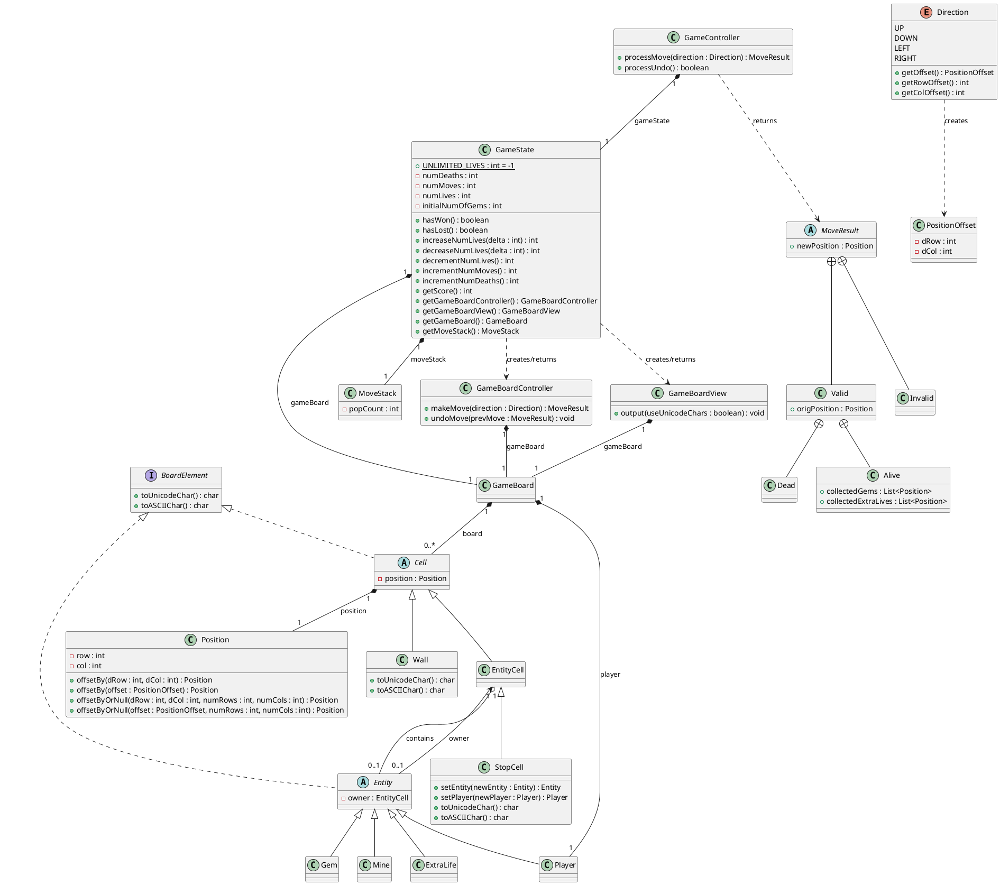

You are a senior Java software engineer.

Based on the requirement, class diagram, and already implemented classes, generate the complete Java project code.

## Goal
Create the missing Java classes and complete the project implementation.

## Inputs
### Input 1: Requirements
```text
1.Overview
This project implements a grid-based puzzle game called Inertia. The core mechanic is inertial sliding: once the player chooses a direction, the character slides continuously in that direction until it hits a Wall or enters a StopCell. The objective is to navigate the board to collect all Gems while avoiding Mines that cause death and life loss. The game features a scoring system, life management, and an Undo system to backtrack moves.
2.Functional Requirements
The system manages 2D grid coordinates and their deltas through the Position and PositionOffset classes for all
movement calculations and boundary checks. In GameBoardController.makeMove, when a move is initiated via a Direction,
the player piece moves step-by-step from its current Position. If the player passes through a Gem or ExtraLife, these
are collected and removed from the board. Sliding stops immediately before a Wall, at the board boundary, or exactly
on a StopCell. StopCell is a special cell type that can only contain a Player entity. Hitting a Mine causes a Dead
result, stops movement, and reverts the player's position to the original position before the move. A move returns
Invalid when the player cannot move at all (blocked by Wall or boundary on the first step, resulting in zero movement
distance). Every move must return a MoveResult (Alive, Dead, or Invalid) to record the outcome and collected entities.
In GameState, a player wins when the number of collected gems equals the initial total. A player loses when lives
reach zero (unless in unlimited lives mode). The score is calculated as: Score = InitialBoardSize + (Gems * 10) -
(Moves * 1) - (Undoes * 2) - (Deaths * 4). If numLives is less than zero, the player has unlimited lives, and
getNumLives returns Integer.MAX_VALUE. In GameController and MoveStack, Only MoveResult.Valid.Alive is pushed to MoveStack and is undoable. Dead and Invalid are never pushed.
GameStateSerializer: A tool for loading/saving the game state from/to text format, handling the mapping between characters (W, P, S, G, M, L) and Ecore classes. 
InertiaTextGame: The main runner handling the STDIN loop and parsing user commands like U, D, Undo, or Quit. 
```

### Input 2: Class Diagram


### Input 3: Already Implemented Classes    
```java
Wall.java
    @Override
    public char toUnicodeChar() {
        return '\u2588';
    }

    @Override
    public char toASCIIChar() {
        return 'W';
    }

EntityCell.java
 @Override
    public char toUnicodeChar() {
        return getEntity() != null ? getEntity().toUnicodeChar() : '.';
    }

    @Override
    public char toASCIIChar() {
        return getEntity() != null ? getEntity().toASCIIChar() : '.';
    }

StopCell.java
  @Override
    public char toUnicodeChar() {
        return getEntity() != null ? getEntity().toUnicodeChar() : '\u25A1';
    }

    @Override
    public char toASCIIChar() {
        return getEntity() != null ? getEntity().toASCIIChar() : '#';
    }

ExtraLife.java
     @Override
    public char toUnicodeChar() {
        return '\u2661';
    }

    @Override
    public char toASCIIChar() {
        return 'L';
    }
Gem.java 
 @Override
    public char toUnicodeChar() {
        return '\u25C7';
    }

    @Override
    public char toASCIIChar() {
        return '*';
    }
Mine.java 
 @Override
    public char toUnicodeChar() {
        return '\u26A0';
    }

    @Override
    public char toASCIIChar() {
        return 'X';
    }
Player.java 
@Override
    public char toUnicodeChar() {
        return '\u25EF';
    }

    @Override
    public char toASCIIChar() {
        return '@';
    }

GameBoardView.java
import java.util.Objects;

/**
 * A read-only view of a {@link GameBoard}.
 */
public class GameBoardView {

    private final GameBoard gameBoard;

    /**
     * Creates a view of the provided game board.
     *
     * @param gameBoard Game board instance to create a view from.
     */
    public GameBoardView(final GameBoard gameBoard) {
        this.gameBoard = Objects.requireNonNull(gameBoard);
    }

    /**
     * Outputs the textual representation of the game board to {@link System#out}.
     *
     * @param useUnicodeChars If {@code true}, outputs the board elements using Unicode characters (as opposed to ASCII
     *                        characters).
     */
    public void output(final boolean useUnicodeChars) {
        for (int r = 0; r < gameBoard.getNumRows(); ++r) {
            for (int c = 0; c < gameBoard.getNumCols(); ++c) {
                final Cell cell = gameBoard.getCell(r, c);
                final char ch = useUnicodeChars ? cell.toUnicodeChar() : cell.toASCIIChar();

                System.out.print(ch);
            }
            System.out.println();
        }
    }
}


GameStateSerializer.java
**
 * Serializer for converting between a serialized file and a {@link GameState}.
 */
public class GameStateSerializer {

    private GameStateSerializer() {
    }

    /**
     * Serializes the specified {@link GameState} object to the output file.
     *
     * @param gameState  The game state instance to write to the file.
     * @param outputFile The file to write to.
     * @return {@code outputFile}.
     * @throws FileAlreadyExistsException if a file or directory already exists with the same path as
     *                                    {@code outputFile}.
     */
    public static Path writeTo(final GameState gameState, final Path outputFile)
            throws FileAlreadyExistsException {
        Objects.requireNonNull(gameState);
        Objects.requireNonNull(outputFile);

        if (Files.exists(outputFile)) {
            throw new FileAlreadyExistsException(outputFile.toString());
        }

        try (BufferedWriter writer = Files.newBufferedWriter(outputFile)) {
            writeTo(gameState, writer);
        } catch (final IOException e) {
            throw new RuntimeException(e);
        }
        return outputFile;
    }

    /**
     * Serializes the specified {@link GameState} object into the provided {@link BufferedWriter}.
     *
     * @param gameState The game state to serialize.
     * @param writer    The writer to write the serialized game state to.
     * @throws IOException If an I/O error occurred while writing to {@code writer}.
     * @apiNote The caller is responsible for closing {@code writer}.
     */
    static void writeTo(final GameState gameState, final BufferedWriter writer)
            throws IOException {
        Objects.requireNonNull(gameState);
        Objects.requireNonNull(writer);

        writer.write(Integer.toString(gameState.getGameBoard().getNumRows()));
        writer.newLine();
        writer.write(Integer.toString(gameState.getGameBoard().getNumCols()));
        writer.newLine();
        if (gameState.hasUnlimitedLives()) {
            writer.write("");
        } else {
            writer.write(Integer.toString(gameState.getNumLives()));
        }
        writer.newLine();

        for (int r = 0; r < gameState.getGameBoard().getNumRows(); ++r) {
            final Cell[] row = gameState.getGameBoard().getRow(r);

            for (final Cell cell : row) {
                writer.write(toCellChar(cell));
            }
            writer.newLine();
        }
    }

    /**
     * Loads an input file and deserializes it into a {@link GameState} instance.
     *
     * @param inputFile The input file to read from.
     * @return An instance of {@link GameState} created from deserializing {@code inputFile}.
     * @throws FileNotFoundException if {@code inputFile} does not exist.
     */
    public static GameState loadFrom(final Path inputFile)
            throws FileNotFoundException {
        Objects.requireNonNull(inputFile);

        if (!Files.isRegularFile(inputFile)) {
            throw new FileNotFoundException(inputFile.toString());
        }

        try (BufferedReader reader = Files.newBufferedReader(inputFile)) {
            return loadFrom(reader);
        } catch (IOException e) {
            throw new RuntimeException(e);
        }
    }

    /**
     * Creates a {@link GameState} instance by reading from the {@link BufferedReader}.
     *
     * @param reader The reader providing the serialized version of the game state.
     * @return An instance of {@link GameState} created from deserializing {@code reader}.
     * @throws IOException If an I/O error occurred while reading from {@code reader}.
     * @apiNote The caller is responsible for closing {@code reader}.
     */
    static GameState loadFrom(final BufferedReader reader) throws IOException {
        Objects.requireNonNull(reader);

        final int numRows = Integer.parseInt(reader.readLine());
        final int numCols = Integer.parseInt(reader.readLine());
        final int numLives;
        {
            final String line = reader.readLine();
            if (line.isBlank()) {
                numLives = -1;
            } else {
                numLives = Integer.parseInt(line);
            }
        }

        final Cell[][] board = new Cell[numRows][numCols];
        for (int r = 0; r < numRows; r++) {
            final String line = reader.readLine();
            for (int c = 0; c < numCols; ++c) {
                board[r][c] = fromCellChar(line.charAt(c), new Position(r, c));
            }
        }

        final GameBoard gameBoard = new GameBoard(numRows, numCols, board);
        return numLives < 0 ? new GameState(gameBoard) : new GameState(gameBoard, numLives);
    }

    /**
     * Converts an instance of {@link Cell} to its serialized character representation.
     *
     * @param cell The instance of cell to serialize.
     * @return A {@code char} representing {@code cell}.
     */
    private static char toCellChar(final Cell cell) {
        Objects.requireNonNull(cell);

        if (cell instanceof Wall) {
            return 'W';
        }

        final EntityCell cellWithEntity = (EntityCell) cell;

        // Entity takes precedence over the cell
        // We can infer the type of cell from the entity anyways
        final Entity entity = cellWithEntity.getEntity();
        if (entity instanceof ExtraLife) {
            return 'L';
        }
        if (entity instanceof Gem) {
            return 'G';
        }
        if (entity instanceof Mine) {
            return 'M';
        }
        if (entity instanceof Player) {
            return 'P';
        }

        if (cellWithEntity instanceof StopCell) {
            return 'S';
        }
        return '.';
    }

    /**
     * Converts the serialized character representation of a {@link Cell} to an instance.
     *
     * @param c        The character representing a cell.
     * @param position The position of the cell on the game board.
     * @return An instance of {@link Cell} which is represented by {@code c}.
     * @throws IllegalArgumentException if {@code c} is not a known representation of a cell.
     */
    private static Cell fromCellChar(final char c, final Position position) {
        Objects.requireNonNull(position);

        return switch (c) {
            case 'W' -> new Wall(position);
            case 'L' -> new EntityCell(position, new ExtraLife());
            case 'G' -> new EntityCell(position, new Gem());
            case 'M' -> new EntityCell(position, new Mine());
            case 'P' -> new StopCell(position, new Player());
            case 'S' -> new StopCell(position);
            case '.' -> new EntityCell(position);
            default -> throw new IllegalArgumentException("Unknown cell representation: " + c);
        };
    }
}

```


