You are a senior Java software engineer.

Based on the requirement, class diagram, and already implemented classes, generate the complete Java project code.

## Goal
Create the missing Java classes and complete the project implementation.

## Inputs
### Input 1: Requirements
```text
1.Overview This project implements a multi-player variant of the classic grid-based puzzle game called Sokoban. The core mechanic involves players moving around a closed-boundary map to push boxes to specific destinations. A unique feature of this variant is that it supports multiple players (up to 26), and each player can only push their designated boxes. The objective is to navigate the board and strategically place all boxes onto the designated targets. The game features customizable undo quotas, action validation, and a terminal-based text user interface (TUI).  
2.Functional Requirement
The system manages 2D grid coordinates through the Position class. The system manages 2D grid coordinates through the Position class. The game board is initialized via `GameMap.parse`, reading a text representation where the first line is the undo limit, # denotes walls, @ denotes destinations, . denotes empty spaces, upper-case letters denote Players, and lower-case letters denote Boxes. `GameMap.parse` also validates the map: the map must be a closed boundary, there must be at least one player, the number of destinations must equal the number of boxes, and boxes must reference valid player IDs that exist in the map.
  The dynamic game state is handled by GameState, which keeps track of entities and destinations. During Move actions (Up, 
  Down, Left, Right), a player attempts to move to a nextPosition. A player can move into an Empty space or push a Box. A
  Box can only be pushed if it belongs to the initiating player (i.e., Box.getPlayerId() matches the Player's ID) and the  
  space behind the box is empty. Movement is blocked by Walls, other players, or unpushable boxes. Each game action must
  return an ActionResult (Success or Failed with a reason). The game also supports an Exit action that allows the user to  
  quit the game. Terminal input commands are defined as follows: Player 0 uses W (up), A (left), S (down), D (right), R (undo). Player
  1 uses K (up), H (left), J (down), L (right), U (undo). The commands "exit" or "quit" trigger an Exit action with
  initiator = -1. Any other input returns an InvalidInput action with initiator = -1. TerminalSokobanGame: The main
  runner extending AbstractSokobanGame, coordinating the terminal game loop. It restricts the terminal interface to a
  maximum of two players, although the backend supports up to 26. TerminalInputEngine & TerminalRenderingEngine:
  Responsible for reading user commands via Scanner and rendering the game grid to System.out using character
  representations. The render method displays the game board using character representations: Wall is displayed as '#',
  Box as lowercase letter (a-z based on playerId), Player as uppercase letter (A-Z based on playerId), Empty space at
  destination as '@', and other empty spaces as '.'. The message method prints the given content string to the output
  stream followed by a newline.

  The game provides an Undo mechanism: transitions are accumulated during moves, and a checkpoint is recorded when a box is
   successfully pushed; checkpoints are stored in a history stack in GameState. When an Undo action is executed, the game
  reverts using the transition/checkpoint history.Undo transitions must be applied atomically to preserve the correct final state of all entities; undoQuota uses 0 as not allowed and -1 as unlimited, and finite quota is
   consumed only when there is a checkpoint in history to undo. A game is won (GameState.isWin) when every destination
  position in the map is currently occupied by a Box.
 3.External Utilities and Known Information. SokobanGameFactory & Sokoban: The entry points that load map files, parse
  the board, and initialize the game engines. StringResources: A utility class centralizing all display messages and
  prompts (e.g., WIN_MESSAGE, INVALID_INPUT_MESSAGE, UNDO_QUOTA_TEMPLATE).
```

### Input 2: Class Diagram

```plantuml
@startuml

interface SokobanGame {
  + run() : void
}

abstract class AbstractSokobanGame {
  # state : GameState
  - isExitSpecified : boolean
  # AbstractSokobanGame(gameState : GameState)
  # shouldStop() : boolean
  # processAction(action : Action) : ActionResult
}

class TerminalSokobanGame {
  - inputEngine : InputEngine
  - renderingEngine : RenderingEngine
  + TerminalSokobanGame(gameState : GameState, inputEngine : TerminalInputEngine, renderingEngine : TerminalRenderingEngine)
  + run() : void
}

interface InputEngine {
  + fetchAction() : Action
}

class TerminalInputEngine {
  - terminalScanner : Scanner
  + TerminalInputEngine(terminalStream : InputStream)
  + fetchAction() : Action
}

interface RenderingEngine {
  + render(state : GameState) : void
  + message(content : String) : void
}

class TerminalRenderingEngine {
  - outputStream : PrintStream
  + TerminalRenderingEngine(outputStream : PrintStream)
  + render(state : GameState) : void
  + message(content : String) : void
}

abstract class Action {
  # initiator : int
  # Action(initiator : int)
  + getInitiator() : int
}

class Exit {
  + Exit(initiator : int)
}

class InvalidInput {
  - message : String
  + InvalidInput(initiator : int, message : String)
  + getMessage() : String
}

class Undo {
  + Undo(initiator : int)
}

abstract class Move {
  # Move(initiator : int)
  + {abstract} nextPosition(currentPosition : Position) : Position
}

class Down {
  + Down(initiator : int)
  + nextPosition(currentPosition : Position) : Position
}

class Left {
  + Left(initiator : int)
  + nextPosition(currentPosition : Position) : Position
}

class Right {
  + Right(initiator : int)
  + nextPosition(currentPosition : Position) : Position
}

class Up {
  + Up(initiator : int)
  + nextPosition(currentPosition : Position) : Position
}

abstract class ActionResult {
  # action : Action
  # ActionResult(action : Action)
  + getAction() : Action
}

class Success {
  + Success(action : Action)
}

class Failed {
  - reason : String
  + Failed(action : Action, reason : String)
  + getReason() : String
}

abstract class Entity {
}

class Box {
  - playerId : int
  + Box(playerId : int)
  + getPlayerId() : int
}

class Empty {
}

class Player {
  - id : int
  + Player(id : int)
  + getId() : int
}

class Wall {
}

class Position {
  - x : int
  - y : int
  + Position(x : int, y : int)
  + x() : int
  + y() : int
  + {static} of(x : int, y : int) : Position
}

class GameMap {
  - map : Map<Position, Entity>
  - maxWidth : int
  - maxHeight : int
  - destinations : Set<Position>
  - undoLimit : int
  + GameMap(maxWidth : int, maxHeight : int, destinations : Set<Position>, undoLimit : int)
  - GameMap(map : Map<Position, Entity>, destinations : Set<Position>, undoLimit : int)
  + {static} parse(mapText : String) : GameMap
  + getEntity(position : Position) : Entity
  + putEntity(position : Position, entity : Entity) : void
  + getDestinations() : Set<Position>
  + getUndoLimit() : Optional<Integer>
  + getPlayerIds() : Set<Integer>
}

class GameState {
}




SokobanGame <|.. AbstractSokobanGame
AbstractSokobanGame <|-- TerminalSokobanGame

InputEngine <|.. TerminalInputEngine
RenderingEngine <|.. TerminalRenderingEngine

Action <|-- Exit
Action <|-- InvalidInput
Action <|-- Undo
Action <|-- Move

Move +-- Down
Move +-- Left
Move +-- Right
Move +-- Up

Move <|-- Down
Move <|-- Left
Move <|-- Right
Move <|-- Up

ActionResult +-- Success
ActionResult +-- Failed

ActionResult <|-- Success
ActionResult <|-- Failed

Entity <|-- Box
Entity <|-- Empty
Entity <|-- Player
Entity <|-- Wall



AbstractSokobanGame "1" *-- "1" GameState : state
TerminalSokobanGame "1" *-- "1" InputEngine : inputEngine
TerminalSokobanGame "1" *-- "1" RenderingEngine : renderingEngine

ActionResult "1" o-- "1" Action : action

GameMap "1" *-- "*" Entity : map
GameMap "1" *-- "*" Position : destinations

@enduml
```


### Input 3: Already Implemented Classes    
```java
   GameMap.java:
   public GameMap(int maxWidth, int maxHeight, Set<Position> destinations, int undoLimit) {
        this.maxWidth = maxWidth;
        this.maxHeight = maxHeight;
        this.destinations = Collections.unmodifiableSet(destinations);
        this.undoLimit = undoLimit;
        this.map = new HashMap<>();
    }

    private GameMap(Map<Position, Entity> map, Set<Position> destinations, int undoLimit) {
        this.map = Collections.unmodifiableMap(map);
        this.destinations = Collections.unmodifiableSet(destinations);
        this.undoLimit = undoLimit;
        this.maxWidth = map.keySet().stream().mapToInt(Position::x).max().orElse(0) + 1;
        this.maxHeight = map.keySet().stream().mapToInt(Position::y).max().orElse(0) + 1;
    }

SokobanGameFactory.java

import java.io.IOException;
import java.net.URISyntaxException;
import java.net.URL;
import java.nio.file.Files;
import java.nio.file.Path;

/**
 * Factory for creating Sokoban games
 */
public class SokobanGameFactory {

    /**
     * Create a TUI version of the Sokoban game.
     *
     * @param mapFile map file.
     * @return The Sokoban game.
     * @throws IOException if mapFile cannot be load
     */
    public static SokobanGame createTUIGame(String mapFile) throws IOException {
        Path file;
        if (!mapFile.endsWith(".map")) {
            // treat as built-in maps
            final URL resource = SokobanGameFactory.class.getClassLoader().getResource(mapFile + ".map");
            if (resource == null) throw new RuntimeException("No such built-in map: " + mapFile);
            try {
                file = Path.of(resource.toURI());
            } catch (URISyntaxException e) {
                throw new RuntimeException("Error loading map:" + mapFile);
            }
        } else {
            file = Path.of(mapFile);
        }
        final GameMap gameMap = loadGameMap(file);
        return new TerminalSokobanGame(
            new GameState(gameMap),
            new TerminalInputEngine(System.in),
            new TerminalRenderingEngine(System.out)
        );
    }
    /**
     * @param mapFile The file containing the game map.
     * @return The parsed game map.
     * @throws IOException When there is an issue loading the file.
     */
    public static GameMap loadGameMap(Path mapFile) throws IOException {
        final String fileContent = Files.readString(mapFile);
        return GameMap.parse(fileContent);
    }
}

Sokoban.Java

import assignment.game.SokobanGame;
import java.io.IOException;

/**
 * The holder of the entry point of the game.
 */
public class Sokoban {

    /**
     * The entry point of the program.
     *
     * @param args The command line args.
     */
    public static void main(String[] args) {
        if (args.length < 1) {
            System.err.println("Map is not provided.");
            System.exit(1);
        }
        final String mapFile = args[0];
        try {
            final SokobanGame game = SokobanGameFactory.createTUIGame(mapFile);
            game.run();
        } catch (IOException e) {
            System.err.println("Failed to load game map: " + e);
            System.exit(1);
        }
    }
}


NotImplementedException.java
/**
 * Throw to indicate that the feature is not implemented.
 */
public class NotImplementedException extends RuntimeException {
}


ShouldNotReachException.java
/**
 * Thrown when a branch should not be reached. Used to avoid compilation error.
 */
public class ShouldNotReachException extends RuntimeException {

    /**
     * Create a new should not reach exception.
     */
    public ShouldNotReachException() {
        super("This branch should not be reached.");
    }
}


StringResources.java
@SuppressWarnings("MissingJavadoc")
public class StringResources {

    public static final String GAME_READY_MESSAGE = "Sokoban game is ready.";
    public static final String INVALID_INPUT_MESSAGE = "Invalid Input.";


    public static final String UNDO_QUOTA_TEMPLATE = "Undo Quota: %s";
    public static final String UNDO_QUOTA_UNLIMITED = "Unlimited";
    public static final String UNDO_QUOTA_RUN_OUT = "You have run out of your undo quota.";

    public static final String PLAYER_NOT_FOUND = "Player not found.";

    public static final String GAME_EXIT_MESSAGE = "Game exits.";
    public static final String WIN_MESSAGE = "You win.";

    public static final String EXIT_COMMAND_TEXT = "exit";
}


```


